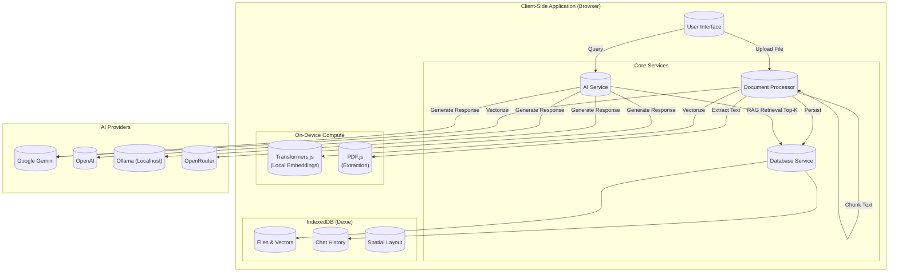

# IRIE AI | Knowledge Operating System

  

**IRIE AI** is a secure, local-first **Knowledge Operating System**. Unlike traditional chatbots that send your data to the cloud blindly, IRIE AI indexes your documents (PDF, TXT, MD, CSV) directly in your browser using IndexedDB and Vector Embeddings.

It creates a "neural layer" over your files, allowing you to chat, reason, and visualize connections securely using a Multi-Model architecture (Gemini, OpenAI, Ollama, OpenRouter).

---

## System Architecture


IRIE runs primarily in the browser. It uses `Transformers.js` for local embeddings (optional) or Gemini for cloud embeddings, `Dexie.js` for persistent local storage, and `PDF.js` for parsing.



---

## Key Features

### 1. Zero-Trust RAG Pipeline
- **Smart Indexing**: Uploads are chunked semantically and stored locally in IndexedDB.
- **Hybrid Embeddings**: Choose between purely local embeddings (running in-browser via Transformers.js) for air-gapped security, or high-quality Cloud embeddings (Gemini/OpenAI).
- **Privacy First**: Your documents never leave your device unless you explicitly choose a cloud model for inference.

### 2. Multi-Model Core
- **Agnostic Intelligence**: Switch instantly between models based on your needs:
    - **Google Gemini 1.5**: Best for long context and speed.
    - **GPT-4o**: High reasoning capabilities.
    - **Ollama (Llama 3)**: 100% Offline and Private.
    - **OpenRouter**: Access to Claude 3 Opus, Mistral, and more.

### 3. Adaptive Personas
The system changes its reasoning style based on your active role:
- **Analyst**: Rigorous fact-checking and data synthesis.
- **Tutor**: Socratic teaching method with analogies.
- **Critic**: Devil's advocate to find logical fallacies in your docs.
- **Coder**: Software architecture and clean code generation.

### 4. Spatial Workspace & Extraction
- **Spatial Canvas**: Break free from linear chat. Drag, drop, and organize files and AI responses on an infinite 2D canvas.
- **Entity Extraction**: Automatically convert unstructured text into structured JSON tables (People, Locations, Dates, Metrics).

---

## Tech Stack

*   **Frontend**: React 18, TypeScript, TailwindCSS
*   **State/Storage**: Dexie.js (IndexedDB wrapper)
*   **AI/ML**: 
    *   `@google/genai` (Gemini SDK)
    *   `@xenova/transformers` (In-browser Inference)
    *   `pdfjs-dist` (PDF Parsing)
*   **Visualization**: Custom Spatial Canvas (SVG/React)

---

## Getting Started

### Prerequisites
*   Node.js (v18+)
*   A Google Gemini API Key (recommended for best performance)

### Installation

1.  Clone the repository:
    ```bash
    git clone https://github.com/IrieAlberic/irie-ai.git
    cd irie-ai
    ```

2.  Install dependencies:
    ```bash
    npm install
    ```

3.  Set up environment variables (Optional):
    Create a `.env` file:
    ```env
    API_KEY=your_gemini_api_key_here
    ```

4.  Start the development server:
    ```bash
    npm start
    ```

---

## Configuration

### Setting up Ollama (Local LLM)
To use IRIE completely offline with Ollama:
1.  Install [Ollama](https://ollama.com).
2.  Pull a model: `ollama run llama3`.
3.  **Important**: You must enable CORS in Ollama to allow the browser to talk to it.
    *   **Mac/Linux**: `OLLAMA_ORIGINS="*" ollama serve`
    *   **Windows**: Set the environment variable `OLLAMA_ORIGINS` to `*`.
4.  In IRIE Settings, select **Ollama** provider.

---

## Roadmap

*   [ ] **Podcast Mode**: Generate audio conversations from documents (Coming Soon).
*   [ ] **Web Search Grounding**: Connect Gemini Search tools for live info.
*   [ ] **Graph View**: Force-directed graph visualization of knowledge nodes.

---

*Built for the future of Personal Knowledge Management.*
